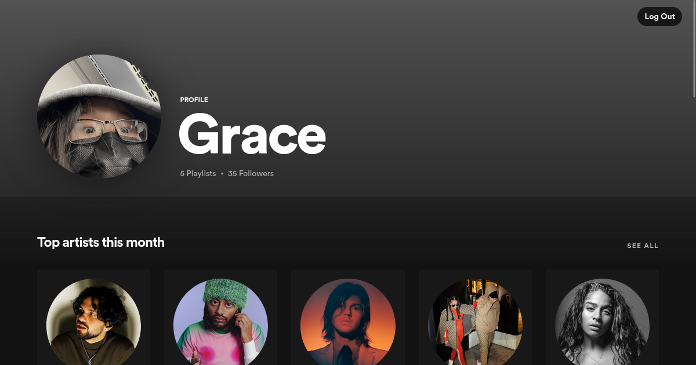

# spotify-rewind
This React and Express app uses the Spotify Web API to display a Spotify user's top tracks, playlists, and artists.

Check it out at [https://spotifyrewind.dev/](https://spotifyrewind.dev/)! 🎉🎉🎉




## Local Development
- add your Spotify Developer keys to `./client/.env` and `./server/.env`
### With Docker
```Bash
docker build -t kaiweimo/spotify-rewind-frontend ./client
docker run -d -p 3000:3000 kaiweimo/spotify-rewind-frontend

docker build -t kaiweimo/spotify-rewind-backend ./server
docker run -d -p 8888:8888 kaiweimo/spotify-rewind-backend
```

### With Node
```Bash
cd client
npm install
npm start
```
```Bash
cd server
npm install
npm start
```
